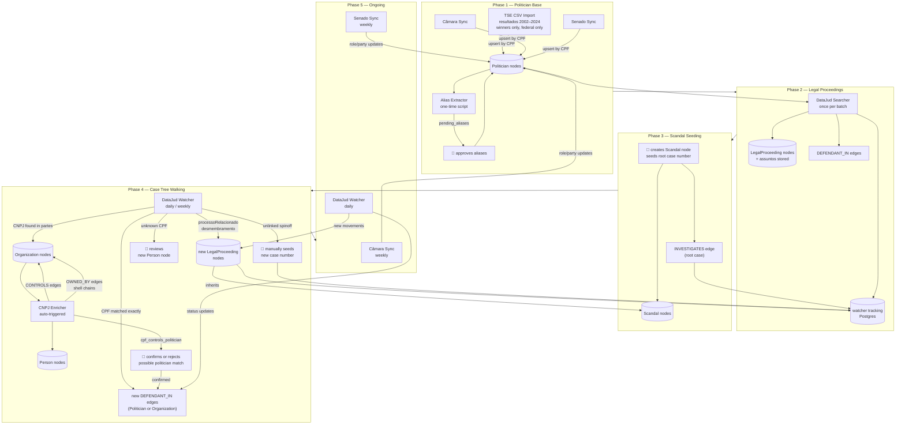

# Source and Worker definitions, schedules and responsibilities

---

## TSE CSV Import

**Responsibility**
Imports historical winners of federal elections from TSE bulk CSVs for election
years 2002–2024. Uses the `resultados` dataset.

**Logic**

1. Download `resultados_{year}` ZIP from TSE for each election year
2. Decompress in memory, stream-parse CSV row by row (encoding: windows-1252)
3. Skip row immediately unless both conditions met — no memory cost:
   - `DS_CARGO` is one of: `DEPUTADO FEDERAL`, `SENADOR`, `PRESIDENTE`, `VICE-PRESIDENTE`
   - `DS_SIT_TOT_TURNO` is one of: `ELEITO`, `ELEITO POR QP`, `ELEITO POR MÉDIA`
4. Upsert `Politician` by `NR_CPF_CANDIDATO` — stored as `cpf` on the node
5. Any name variation for the same CPF across years → append to `name_aliases` automatically
6. Store `SQ_CANDIDATO` and `tse_profile_url` for reference

**Auth**
None

**Docs**
`https://dadosabertos.tse.jus.br/dataset/resultados-2024`

**Format**
CSV inside ZIP, windows-1252 encoding

**Schedule**
Manually triggered — one run per election year. Re-run after each new election cycle.

---

## Câmara Sync

**Responsibility**
Fetches all current federal deputies and upserts them as `Politician` nodes.
Updates party, role, and photo for existing nodes. Source of truth for current
mandate info — takes precedence over TSE CSV data.

**Logic**

1. `GET /deputados` — paginate through full deputy list
2. For each deputy `GET /deputados/{id}` — fetch full profile including CPF
and party history
3. Upsert `Politician` by `cpf` — create if not exists, update `party_current`,
   `role_current`, `photo_url`, `active`
4. Store raw `id` from Câmara API in properties for future delta syncs

**Auth**
None

**Docs**
`https://dadosabertos.camara.leg.br/swagger/api.html`

**Format**
JSON

**Schedule**
Weekly

---

## Senado Sync

**Responsibility**
Fetches all current federal senators and upserts them as `Politician` nodes.
Updates party, role, and photo for existing nodes. Source of truth for current
mandate info — takes precedence over TSE CSV data.

**Logic**

1. `GET /senador/lista/atual.json` — full senator list
2. For each senator `GET /senador/{codigo}/historico.json` — mandate history
and party affiliations
3. Upsert `Politician` by `cpf` — create if not exists, update `party_current`,
   `role_current`, `photo_url`, `active`

**Auth**
None

**Docs**
`https://legis.senado.leg.br/dadosabertos/api-docs/swagger-ui/index.html`

**Format**
JSON (append `.json` or send `Accept: application/json` — default is XML)

**Schedule**
Weekly

---

## DataJud Searcher

**Responsibility**
One-time search pass across all `Politician` and `Person` nodes to find their
legal proceedings in all Brazilian courts. Seeds the `LegalProceeding` nodes
and `DEFENDANT_IN` edges that `DataJud Watcher` will then track ongoing.
**Logic**

1. For each `Politician` / `Person` node not yet searched:
   - Fan out concurrent searches to STF, STJ, TRF1–6 endpoints
   - Query by full name + CPF (where available)
   - Filter by `classeProcessual`: INQ, AP, APN, IPL, ACO (corruption-relevant classes)
   - Filter by `assuntos` codes related to crimes against public administration
2. For each matching case:
   - Create `LegalProceeding` node if not exists (dedup by `case_number`)
   - Store `assuntos` array on the node — used later for scandal cluster detection
   - Create `DEFENDANT_IN` edge with current `outcome` from latest movement
   - Register case with watcher tracking table in Postgres
3. Follow `processoRelacionado` references — if a case links to another,
ingest that too
4. Flag cases where CPF matches are ambiguous → human review in backoffice

**Auth**

```js
headers = {
  "Authorization": "ApiKey {key}",
  "Content-Type": "application/json"
}
```

**Docs**
`https://datajud-wiki.cnj.jus.br/api-publica`

**Format**
JSON — Elasticsearch query DSL. Pagination via `search_after`.

**Schedule**
Manually triggered — run once after each politician import batch, then on
demand for new nodes.

---

## DataJud Watcher

**Responsibility**
Keeps all known `LegalProceeding` nodes up to date by polling for new movements.
Primary engine for keeping the graph live — discovers new defendants, updates
conviction statuses, walks the full case tree from a root proceeding, and flags
unlinked spinoff cases for human review.

**Logic**

1. Load all tracked `LegalProceeding` nodes from Postgres watcher table
2. For each case, query its tribunal endpoint with `numeroProcesso`
3. Compare `movimentos` against last known movement ID stored in Postgres
4. For each new movement:
   - `Recebimento de denúncia` → update `DEFENDANT_IN.outcome` to `pending`
   - `Condenação` → update to `convicted`
   - `Absolvição` → update to `acquitted`
   - `Prescrição` → update to `prescribed`, set `LegalProceeding.status` to `concluded`
   - `Inclusão de parte` → extract CPF/CNPJ:
     - CPF matches `Politician` exactly → new `DEFENDANT_IN` edge
     - CNPJ matches `Organization` → new `DEFENDANT_IN` edge on org
       (org is a case defendant)
     - CPF unknown → create `Person` node, flag for review
     - CNPJ unknown → create `Organization` node (with CNPJ only),
       trigger `CNPJ Enricher`, flag for review
   - `Desmembramento` → extract new case number → new `LegalProceeding` node,
     inherit `INVESTIGATES` edge to same `Scandal`, register with watcher automatically
5. On each poll also check `processoRelacionado` field:
   - Any related case not yet tracked → ingest, inherit `INVESTIGATES` edge, register with watcher
   - This walks the full case tree from the human-seeded root automatically

**Case tree model**
Each `Scandal` is seeded by a human with one root case number. The watcher walks
`processoRelacionado` and `desmembramento` movements to discover the full tree
automatically. The only gap is a genuinely new investigation with no reference
back to the root — these are rare but must be manually added to the watcher
tracking table via the backoffice.

**Auth**

```js
headers = {
  "Authorization": "ApiKey {key}",
  "Content-Type": "application/json"
}
```

**Docs**
`https://datajud-wiki.cnj.jus.br/api-publica`

**Format**
JSON — Elasticsearch query DSL

**Schedule**

- Active proceedings (`status: ongoing`): daily
- Concluded proceedings (`status: concluded`): weekly (late movements still appear)

---

## CNPJ Enricher

**Responsibility**
Enriches `Organization` nodes that have a CNPJ but are missing detailed data.
Also extracts QSA (Quadro de Sócios e Administradores) board members, creates
`Person` nodes, and detects shell ownership chains between organizations.

**Logic**

1. Load all `Organization` nodes missing enrichment data from Memgraph
2. For each org `GET https://publica.cnpj.ws/cnpj/{cnpj}`
3. Update `Organization` node:
   - `name` ← razão social
   - `active` ← `situação: Ativa` → true, `Baixada/Suspensa` → false
   - `type` ← `natureza_jurídica` as free string (e.g. `"2054 - Sociedade Anônima Fechada"`)
   - `uf` ← UF from address
   - `share_capital_brl` ← capital social
   - `main_activity` ← primary CNAE description
4. For each entry in `qsa` (board members):
   - If entry has **CPF** (individual):
     - Attempt partial match against `Politician` nodes by masked CPF pattern
     - Match found → create `pending_review` entry of type `cpf_controls_politician`
       with both IDs — never create the edge directly, always requires human confirmation
     - No match → create `Person` node, create `CONTROLS` edge
   - If entry has **CNPJ** (another company):
     - Upsert `Organization` node for that CNPJ
     - Create `OWNED_BY` edge — this is a shell ownership chain
     - Trigger enrichment for the new org if not yet enriched
5. Respect rate limit: ~3 req/s

**Auth**
None

**Docs**
`https://publica.cnpj.ws`

**Format**
JSON

**Schedule**
Triggered automatically when `DataJud Watcher` creates new `Organization` nodes.
Also manually triggerable on demand.

---

## Alias Extractor

**Responsibility**
One-time script to populate `name_aliases` for all `Politician` nodes.
Combines automatic cross-source name matching with Wikipedia-based popular
name extraction.

**Logic**

1. **Cross-source matching** (automatic, no NLP):
   - Group all imported records by CPF across TSE/Câmara/Senado
   - Any name variation for the same CPF → candidate alias
   - Normalize (uppercase, remove accents) before diffing
2. **Wikipedia extraction** (NLP):
   - `GET https://pt.wikipedia.org/api/rest_v1/page/summary/{name}` per politician
   - Extract all bold terms from intro paragraph — Wikipedia convention marks
     popular names in bold in the first sentence
   - Diff against known names → candidate aliases
3. Write all candidates to `pending_aliases` table in Postgres
4. Backoffice surfaces them for human approval before writing to Memgraph

**Auth**
None (Wikipedia API is open)

**Docs**
`https://pt.wikipedia.org/api/rest_v1/#/Page%20content`

**Format**
JSON

**Schedule**
One-time script — run once after initial politician import. Re-run after each
TSE CSV import cycle.

---

## Flow


