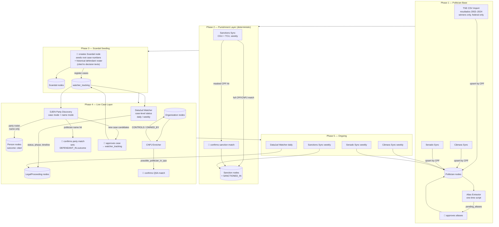

# Source and Worker definitions, schedules and responsibilities

All sources are official government open-data services (TSE, Câmara, Senado,
CNJ, CGU, TCU, Receita Federal via CNPJ.ws). No court front-end scraping, no
third-party aggregators — see `docs/legal_compliance.md`.

---

## TSE CSV Import

**Responsibility**
Imports historical winners of federal elections from TSE bulk CSVs for election
years 2002–2024. Creates `Politician` nodes with `active: false` — Câmara/Senado
sync sets `active: true` for whoever holds a seat today. See `docs/workerDetails/TSE.md`
for full details.

**Logic**

1. Download 56 files per year:
   - `votacao_candidato_munzona_{year}_BR.csv` → Presidente only
   - `votacao_candidato_munzona_{year}_{UF}.csv` × 27 → Deputado Federal + Senador
   - `consulta_cand_{year}_{UF}.csv` × 27 + `_BR` → CPF (not present in votacao files)
2. Stream all votacao files, filter by `DS_CARGO` and `DS_SIT_TOT_TURNO`,
   keep highest `NR_TURNO` per `SQ_CANDIDATO`
3. Join winning `SQ_CANDIDATO` set against `consulta_cand` to get `NR_CPF_CANDIDATO`
4. Upsert `Politician` by `cpf` — `active: false`, all other fields from TSE data
5. Cross-year: name variations for same CPF → append to `name_aliases`
6. Skip `_BR` on even years (no Presidente) — must not fail if file is absent

**Auth**
None — CC-BY license

**Docs**
`https://dadosabertos.tse.jus.br/dataset/resultados-2024` — see also `docs/workerDetails/TSE.md`

**Format**
ISO-8859-1, CRLF, semicolon separator, double-quoted. Null sentinels: `#NULO`/`-1`
= blank, `#NE`/`-3` = field didn't exist that year.

**Schedule**
Manually triggered — one run per election year. Re-run after each new election cycle.

---

## Câmara Sync

**Responsibility**
Fetches all current federal deputies and upserts them as `Politician` nodes.
Updates party, role, and photo for existing nodes. Source of truth for current
mandate info — takes precedence over TSE CSV data.

**Logic**

1. `GET /deputados` — paginate through full deputy list
2. For each deputy `GET /deputados/{id}` — fetch full profile including CPF
and party history
3. Upsert `Politician` by `cpf` — create if not exists, update `party_current`,
   `role_current`, `photo_url`, `active: true`
4. Store raw `id` from Câmara API in properties for future delta syncs

**Auth**
None

**Docs**
`https://dadosabertos.camara.leg.br/swagger/api.html`

**Format**
JSON

**Schedule**
Weekly

---

## Senado Sync

**Responsibility**
Fetches all current federal senators and upserts them as `Politician` nodes.
Updates party, role, and photo for existing nodes. Source of truth for current
mandate info — takes precedence over TSE CSV data.

**Logic**

1. `GET /senador/lista/atual.json` — full senator list
2. For each senator `GET /senador/{codigo}/historico.json` — mandate history and party affiliations
3. Upsert `Politician` by `cpf` — create if not exists, update `party_current`,
   `role_current`, `photo_url`, `active: true`

**Auth**
None

**Docs**
`https://legis.senado.leg.br/dadosabertos/api-docs/swagger-ui/index.html`

**Format**
JSON (append `.json` or send `Accept: application/json` — default is XML)

**Schedule**
Weekly

---

## DataJud Watcher

**Responsibility**
Keeps tracked `LegalProceeding` nodes up to date at the **case level** —
status, phase, movement timeline. The public DataJud API does not expose
parties or related-case references (Portaria CNJ 160/2020), so defendant
discovery and per-defendant outcomes live in the DJEN worker and the
backoffice review flow. Full details: `docs/workerDetails/DATAJUD.md`.

**Logic**

1. Load tracked cases from `watcher_tracking` (Postgres)
2. `POST /{tribunal_endpoint}/_search` by `numeroProcesso`
3. Skip if `nivelSigilo > 0`
4. Diff `movimentos` against `last_movement_id`; apply case-level state
   machine (recebimento/sentença/condenação flags, conclusão codes)
5. Update tracking row

**Auth**
`Authorization: APIKey $DATAJUD_API_KEY` — public key published at
`https://datajud-wiki.cnj.jus.br/api-publica/acesso/`; rotates, never hardcode.

**Docs**
`https://datajud-wiki.cnj.jus.br/api-publica`

**Format**
JSON — Elasticsearch query DSL

**Schedule**
Active cases daily, concluded weekly. ≤ 60 req/min (hard ToU cap: 120).

---

## DJEN Party Discovery

**Responsibility**
Discovers **parties of tracked cases** and **new cases for tracked people**
from the Diário de Justiça Eletrônico Nacional — the CNJ's official national
gazette API (public, keyless). Names only (no CPF/CNPJ), so every Politician
link goes through `pending_review`. Full details: `docs/workerDetails/DJEN.md`.

**Logic**

1. Case mode: `GET /api/v1/comunicacao?numeroProcesso=...` per tracked case →
   party roster from `destinatarios[]` (nome + polo) → Person nodes with
   `DEFENDANT_IN` (outcome `cited`); Politician name hits → `pending_review`
2. Name mode: `GET /api/v1/comunicacao?nomeParte=...` per politician + alias →
   candidate case numbers filtered by criminal/improbidade classes →
   `pending_review` (`djen_case_candidate`); approval registers the case in
   `watcher_tracking`

**Auth**
None

**Docs**
`https://comunicaapi.pje.jus.br/` (Swagger) — gazette UI at `https://comunica.pje.jus.br/`

**Format**
JSON

**Schedule**
Case mode daily (active) / weekly (concluded); name mode weekly. Coverage
starts ~2023 — historical cases need manual seeding.

---

## Sanctions Sync (Portal da Transparência + TCU)

**Responsibility**
Ingests official punishment registries — CPF/CNPJ-keyed, deterministic. Creates
`Sanction` nodes and `SANCTIONED_IN` edges. The authoritative "actually
punished" layer. Full details: `docs/workerDetails/SANCTIONS.md`.

**Logic**

1. CGU: paginate `GET api.portaldatransparencia.gov.br/api-de-dados/{ceis,cnep,ceaf,acordos-leniencia}`
2. TCU: download CSVs from `sites.tcu.gov.br/dados-abertos/inidoneos-irregulares/`
3. Full CPF/CNPJ → deterministic edge; masked CPF politician hit →
   `pending_review`; name-only → `pending_review`
4. New CNPJs → trigger CNPJ Enricher

**Auth**
CGU: free API key (`chave-api-dados` header). TCU: none.

**Docs**
`https://api.portaldatransparencia.gov.br/swagger-ui/index.html` ·
`https://sites.tcu.gov.br/dados-abertos/`

**Format**
JSON (CGU), CSV (TCU)

**Schedule**
Weekly. CGU rate limit 90 req/min.

**Deferred**: CNJ CNCIAI (improbidade convictions) — best conviction source,
but API access requires an institutional request (Portaria CNJ 94). Request
alongside the CNJ notification; do not scrape the public form.

---

## CNPJ Enricher

**Responsibility**
Enriches `Organization` nodes that have a CNPJ but are missing detailed data.
Also extracts QSA (Quadro de Sócios e Administradores) board members, creates
`Person` nodes, and detects shell ownership chains between organizations.

**Logic**

1. Load all `Organization` nodes missing enrichment data from Memgraph
2. For each org `GET {CNPJ_API_BASE}/{cnpj}` — default provider is
   [minha receita](https://docs.minhareceita.org/) (official Receita Federal
   open data; self-hostable to remove rate limits entirely). The old
   publica.cnpj.ws provider was dropped: 3 req/min is unusable at scale.
3. Update `Organization` node:
   - `name` ← razão social
   - `active` ← `situação: Ativa` → true, `Baixada/Suspensa` → false
   - `type` ← `natureza_jurídica` as free string (e.g. `"2054 - Sociedade Anônima Fechada"`)
   - `uf` ← UF from address
   - `share_capital_brl` ← capital social
   - `main_activity` ← primary CNAE description
4. For each entry in `qsa` (board members):
   - If entry has **CPF** (individual):
     - Attempt partial match against `Politician` nodes by masked CPF pattern
     - Match found → create `pending_review` entry of type `possible_politician_in_qsa`
       with both IDs — never create the edge directly, always requires human confirmation
     - No match → create `Person` node, create `CONTROLS` edge
   - If entry has **CNPJ** (another company):
     - Upsert `Organization` node for that CNPJ
     - Create `OWNED_BY` edge — this is a shell ownership chain
     - Trigger enrichment for the new org if not yet enriched
5. Respect rate limit: ~3 req/s

**Auth**
None

**Docs**
`https://docs.minhareceita.org` — implementation details in `backend/workers/cnpj/README.md`

**Format**
JSON

**Schedule**
Weekly (enriches `Organization` nodes flagged un-enriched by DJEN/Sanctions/
backoffice). Also manually triggerable on demand (`--cnpj` single-shot).

---

## Photos Enricher

**Responsibility**
Fills `photo_url` for `Politician` and `Organization` nodes using **hotlinks
only** — no image bytes are ever stored or served by us (minimal server load).
Never overwrites official Câmara/Senado photos.

**Logic**

1. TSE mode (historical politicians): map CPF → SQ_CANDIDATO via
   `consulta_cand` CSVs, then hotlink the official TSE candidate photo.
   Gated behind a pre-flight probe of `--tse-url-template`
   (divulgacandcontas was under maintenance when built — activates once a
   stable pattern is verified; see `backend/workers/photos/README.md`).
2. Wikidata mode: Organizations matched deterministically via CNPJ
   (property P6204) → **P18 image** (never P154 logo — legal constraint) →
   Wikimedia Commons `Special:FilePath` hotlink + attribution string
   (`photo_attribution`, rendered by the frontend — CC-BY-SA requires it).
   Politicians without photos: pt.wikipedia exact-title match → P18;
   ambiguous name matches are skipped, never guessed.

**Auth**
None

**Docs**
`https://www.wikidata.org/wiki/Property:P6204` · `backend/workers/photos/README.md`

**Format**
JSON (SPARQL/REST), CSV (TSE consulta_cand)

**Schedule**
Monthly. ≤ 1 req/s against Wikidata/Wikipedia.

---

## Alias Extractor

**Responsibility**
One-time script to populate `name_aliases` for all `Politician` nodes.
Combines automatic cross-source name matching with Wikipedia-based popular
name extraction.

**Logic**

1. **Cross-source matching** (automatic, no NLP):
   - Group all imported records by CPF across TSE/Câmara/Senado
   - Any name variation for the same CPF → candidate alias
   - Normalize (uppercase, remove accents) before diffing
2. **Wikipedia extraction** (NLP):
   - `GET https://pt.wikipedia.org/api/rest_v1/page/summary/{name}` per politician
   - Extract all bold terms from intro paragraph — Wikipedia convention marks
     popular names in bold in the first sentence
   - Diff against known names → candidate aliases
3. Write all candidates to `pending_aliases` table in Postgres
4. Backoffice surfaces them for human approval before writing to Memgraph

**Auth**
None (Wikipedia API is open)

**Docs**
`https://pt.wikipedia.org/api/rest_v1/#/Page%20content`

**Format**
JSON

**Schedule**
One-time script — run once after initial politician import. Re-run after each TSE CSV import cycle.

---

## Flow

